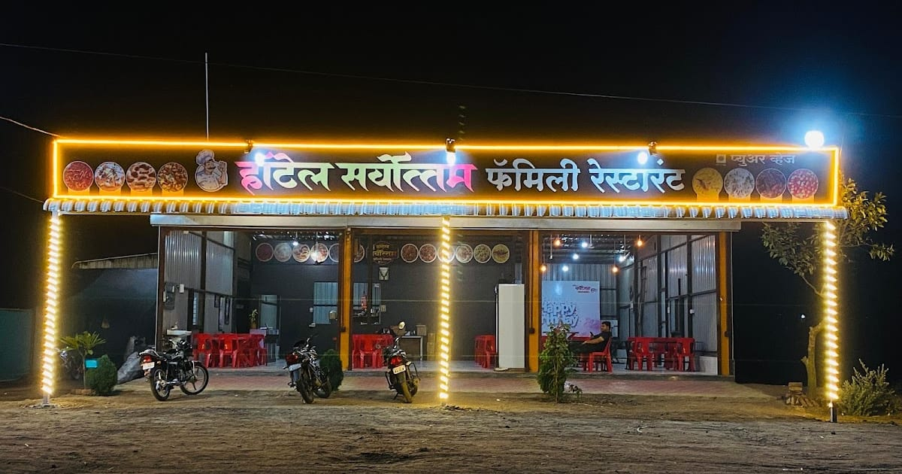
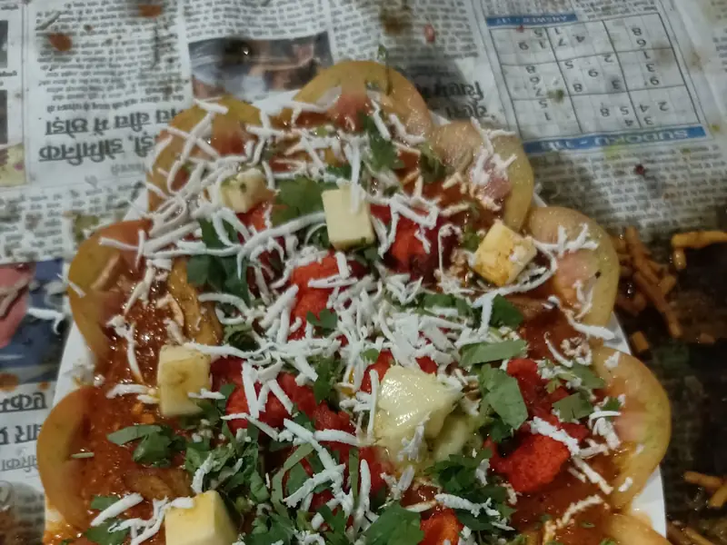
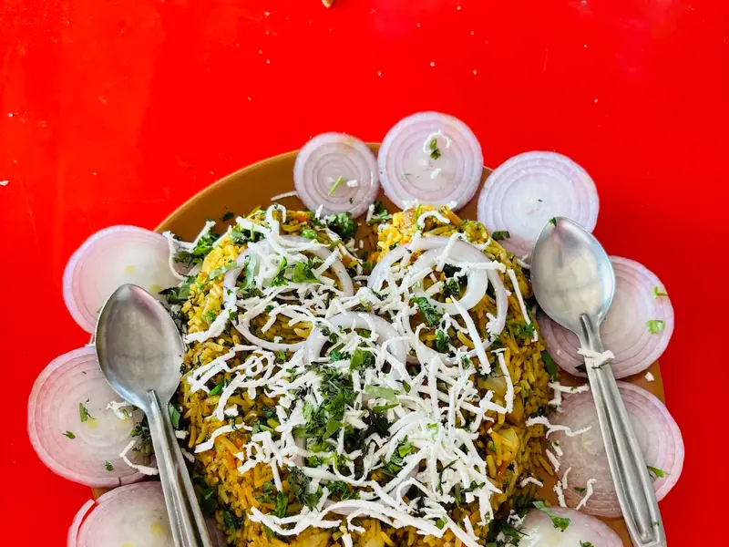
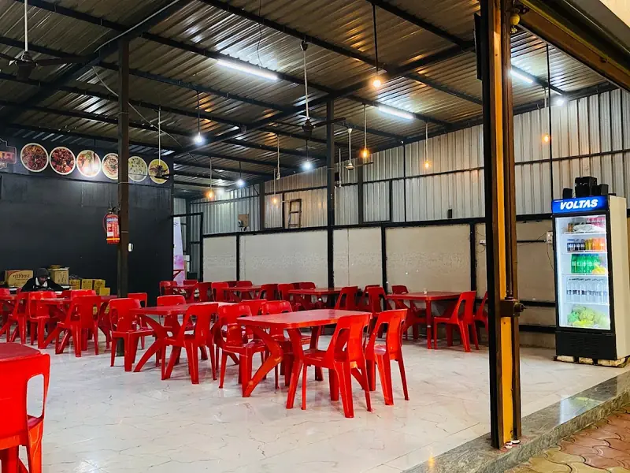
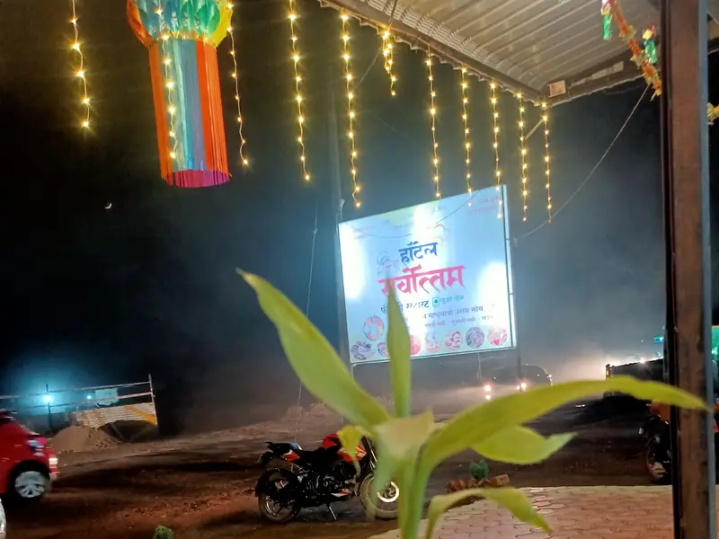
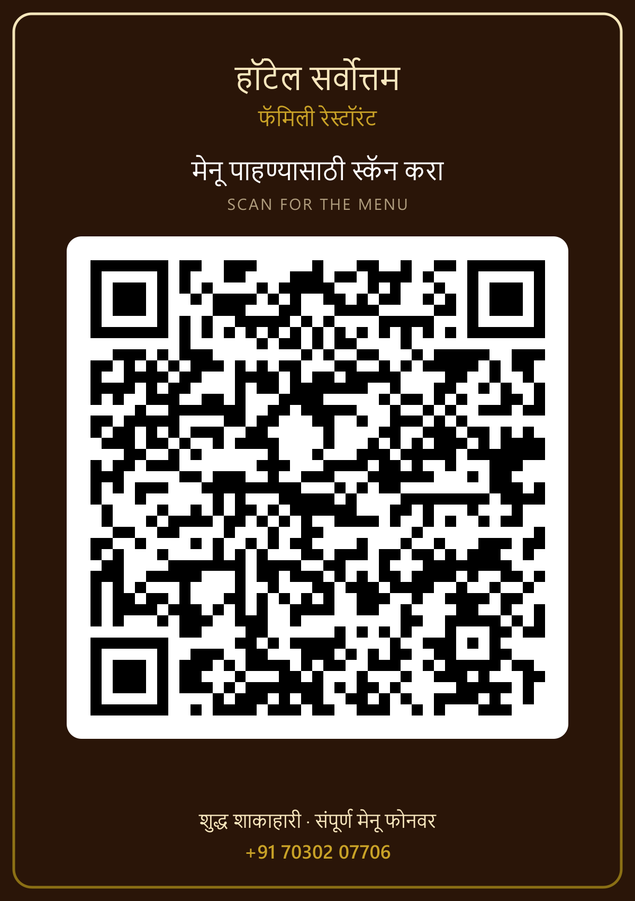
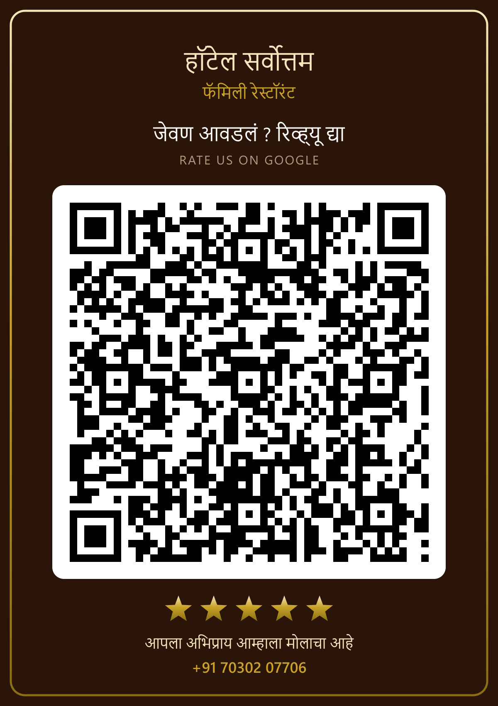

# 🏨 हॉटेल सर्वोत्तम — फॅमिली रेस्टॉरंट

### शुद्ध शाकाहारी · ताजे साहित्य · घरची चव

**मु. पो. कोकणगाव, ता. संगमनेर, जि. अहिल्यानगर — ४१३७१४**

📞 **+91 70302 07706** · 🕛 **दररोज दुपारी १२ ते रात्री ११:३०** · ⭐ **4.6** (69 Google reviews)

🔗 **संपूर्ण मेनू ऑनलाइन पहा — [shubhamdsk.github.io/Hotel-Sarvottam](https://shubhamdsk.github.io/Hotel-Sarvottam/)**

---

## आमच्याविषयी

संगमनेर तालुक्यातील कोकणगाव येथे रस्त्यालगत असलेलं **हॉटेल सर्वोत्तम** हे संपूर्ण शाकाहारी फॅमिली
रेस्टॉरंट आहे. रोजचं ताजं साहित्य, घरच्यासारखा मसाला आणि कुटुंबासोबत निवांत बसून जेवता येईल असं
प्रशस्त हॉल — हीच आमची ओळख.

महाराष्ट्रीय झटका, पंजाबी ग्रेव्ही, पनीरचे ३५ हून अधिक प्रकार, तंदूर, चायनीज आणि खास **हंडी** —
असे **१७४ पदार्थ** आमच्या मेनूमध्ये आहेत.

> **टीप :** ऑर्डर दिल्यानंतर वीस मिनिटे वेळ लागेल.

---

## मेनू — एका दृष्टिक्षेपात

| विभाग                  | Section                | पदार्थ | दर (₹)  |
| ---------------------- | ---------------------- | -----: | ------- |
| स्टार्टर               | Starters               |      7 | 20–50   |
| मेन कोर्स              | Main Course            |     21 | 110–210 |
| महाराष्ट्रीय झटका      | Maharashtrian Specials |      7 | 100–130 |
| सूप                    | Soup                   |      3 | 80–90   |
| सलाड                   | Salad                  |      5 | 30–70   |
| १००% प्युअर व्हेज      | Pure Veg               |     19 | 120–220 |
| व्हेजिटेबल्स           | Vegetables             |     20 | 140–260 |
| उपवास स्पेशल           | Fasting Special        |      2 | 70–120  |
| कोल्ड्रिंक्स           | Cold Drinks            |      2 | 20–30   |
| पनीर स्पेशल            | Paneer Special         |     35 | 160–280 |
| स्पेशल हंडी            | Special Handi          |     11 | 500–800 |
| स्पेशल डिशेस           | Chef's Specials        |      7 | 200–350 |
| तंदूर                  | Tandoor                |     12 | 15–60   |
| सर्वोत्तम स्पेशल राईस  | Special Rice           |     11 | 70–400  |
| चायनीज डिश             | Chinese                |      8 | 130–240 |
| चायनीज राईस            | Chinese Rice           |      4 | 140–170 |

---

## घरची खासियत

- **सर्वोत्तम स्पेशल** आणि **व्हेज तिरंगा** — शेफच्या हातची खास डिश
- **काजू पनीर हंडी** व **पनीर हंडी** — कुटुंबासाठी, चार जणांना पुरेशी
- **पनीर बटर मसाला**, **पनीर टिक्का मसाला**, **शाही पनीर**
- **पिठलं**, **लसूण पिठलं**, **शेंगदाणा ठेचा** — महाराष्ट्रीय झटका
- तंदूरमधून ताजे **नान, रोटी, कुलचा, पराठा**

---

## आमच्या हॉटेलमधून

| | |
| :-: | :-: |
|  |  |
| स्पेशल प्लेटर | गरमागरम बिर्याणी |
|  |  |
| प्रशस्त फॅमिली हॉल | संध्याकाळचं हॉटेल |

---

## QR कोड — टेबलवर लावण्यासाठी

| मेनू QR                                                                            | Google रिव्ह्यू QR                                                                        |
| ---------------------------------------------------------------------------------- | ----------------------------------------------------------------------------------------- |
|  |  |
| स्कॅन केल्यावर संपूर्ण मेनू उघडतो                                                  | स्कॅन केल्यावर Google वर रिव्ह्यू देण्याचं पान उघडतं                                       |

छपाईसाठी मेनू QR: [कार्ड (PNG)](public/qr/menu-qr-card.png) · [फक्त QR (PNG)](public/qr/menu-qr.png) ·
[फक्त QR (SVG)](public/qr/menu-qr.svg)

छपाईसाठी रिव्ह्यू QR: [कार्ड (PNG)](public/qr/review-qr-card.png) ·
[फक्त QR (PNG)](public/qr/review-qr.png) · [फक्त QR (SVG)](public/qr/review-qr.svg)

कार्ड A5 आकारात छापल्यास QR सुमारे ८ सेमीचा येतो — एक हात लांबूनही स्कॅन होतो.

---

## संपर्क

|             |                                                                          |
| ----------- | ------------------------------------------------------------------------ |
| **पत्ता**   | मु. पो. कोकणगाव, ता. संगमनेर, जि. अहिल्यानगर — ४१३७१४                    |
| **फोन**     | [+91 70302 07706](tel:+917030207706)                                     |
| **वेळ**     | दररोज दुपारी १२:०० ते रात्री ११:३०                                        |
| **नकाशा**   | [Google Maps वर पहा](https://www.google.com/maps/place/?q=place_id:ChIJJW9YAZ7_3DsRtVff3_mZMSE) |
| **रिव्ह्यू** | [Google वर अभिप्राय द्या](https://search.google.com/local/writereview?placeid=ChIJJW9YAZ7_3DsRtVff3_mZMSE) |
| **मेनू**    | [shubhamdsk.github.io/Hotel-Sarvottam](https://shubhamdsk.github.io/Hotel-Sarvottam/) |

### || मनःपूर्वक धन्यवाद — पुन्हा भेट द्या ! ||
